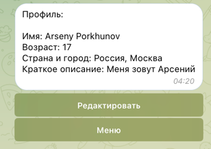
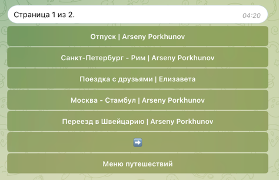
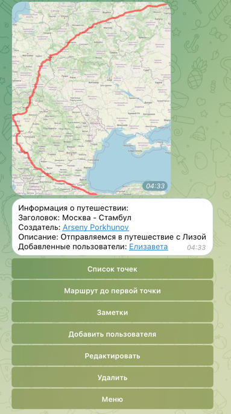
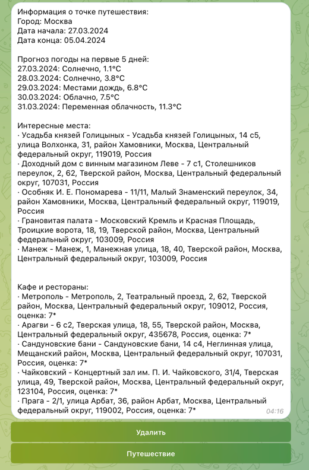
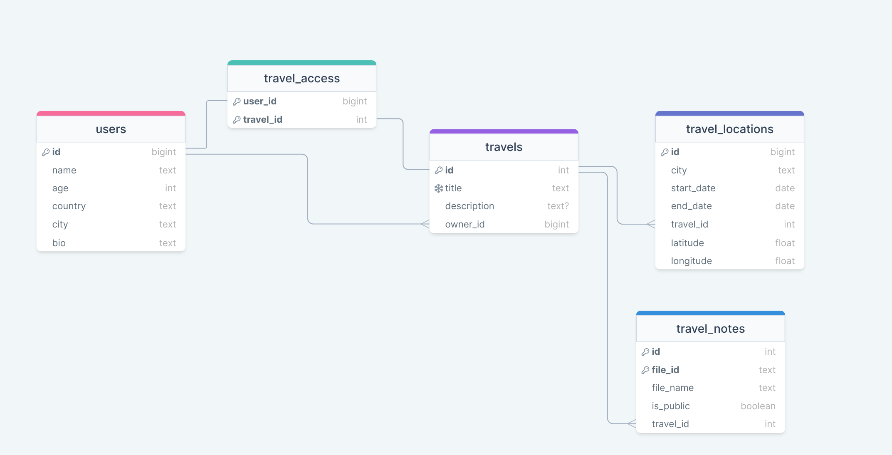

# Travel Agent

## Описание

Телеграм-бот для путешествий. Помогает составить план путешествий и рекомендует места для посещения.

https://t.me/aporkhunov_travel_bot

## Стек технологий и внешние интеграции
- Python
- PostgreSQL - одна из самых популярных СУБД с открытым исходным кодом
- aiogram - асинхронная библиотека для работы с Telegram API, написанная на Python
- SQLAlchemy - библиотека для работы с реляционными СУБД
- Redis - высокопроизводительная СУБД с открытым исходным кодом, используемая для хранения данных в памяти. Используется для хранения данных о состоянии пользователя
- Docker - программное обеспечение для автоматизации развёртывания и управления приложениями в средах с поддержкой контейнеризации
- Docker Compose - инструмент для определения и запуска многоконтейнерных Docker-приложений
- OpenStreetMap - проект по созданию карты мира, свободной для использования
- Open Source Routing Machine (OSRM) - библиотека для построения маршрутов на основе данных OpenStreetMap
- OpenTripMap - открытая база данных географических объектов, которая содержит информацию о миллионах объектов по всему миру
- WeatherApi - сервис, предоставляющий информацию о погоде

Данный стек технологий был выбран из-за своей популярности и удобства использования. Он позволяет быстро разрабатывать и масштабировать проекты. Также он обладает хорошо разработанной документацией.

## Инструкция по развертыванию

1. Установите Docker и Docker Compose
2. Склонируйте репозиторий
3. Отредактируйте файл docker-compose.yml, добавив значения переменных окружения:
    - TELEGRAM_BOT_TOKEN - токен вашего бота
    - WEATHER_API_TOKEN - ключ API сервиса погоды
    - OPENTRIPMAP_API_KEY - ключ API сервиса OpenTripMap

4. Запустите проект с помощью команды:

```
docker-compose up
```

## Демонстрация работы

1. Основное меню


2. Профиль пользователя



3. Список путешествий



4. Информация о путешествии и карта для автомобильного путешествия



5. Информация о локации с погодой, интересными местами и ресторанами



## Схема базы данных


